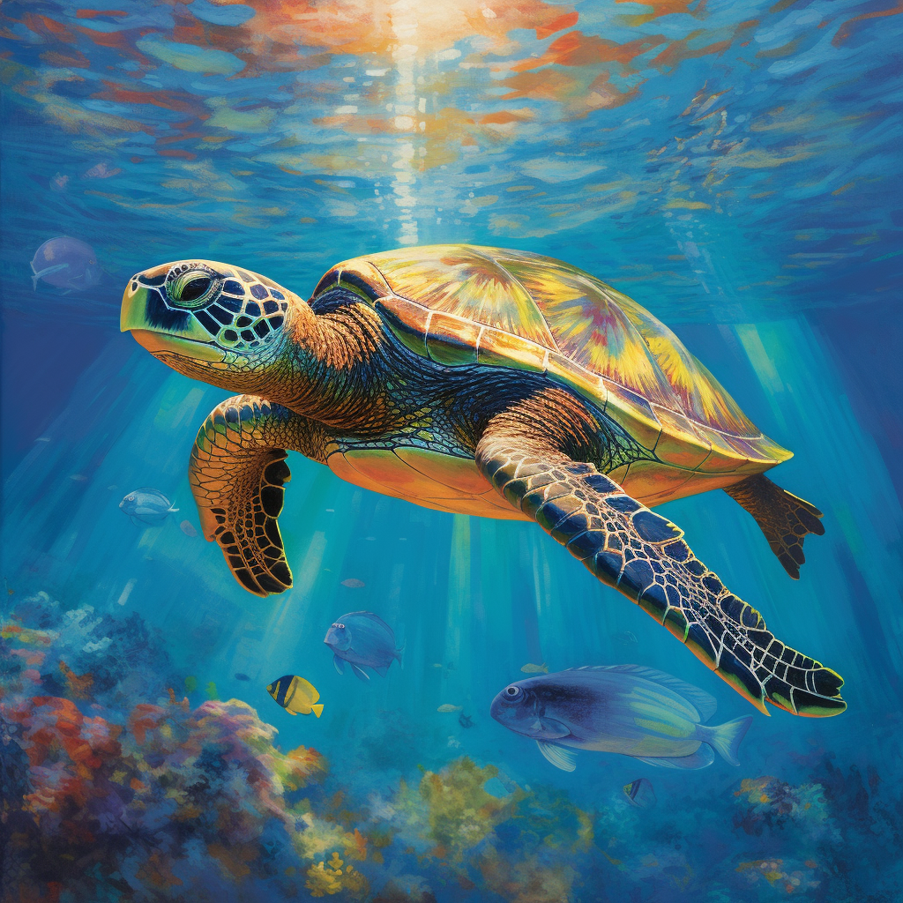

Amy could still recall it as if it had happened yesterday. It was raining. A rare occurrence she now knew. Then, however, that had been her welcome to the world. Before anything else, pouring rain, wind and a booming thunder were all that existed. Water had infiltrated the sand as she pierced her eggshell and dug her way up to the surface. Another turtle would have been scared. Terrified even. But not Amy. No, even though deep down her instincts were telling her to be scared, she wasn't. How could one be? She was alive! Magical patterns illuminated the sky–white flashing lights that came right before a big, crackling noise. Waves were crashing onto the cliffs so violently that even the earth would tremble, joining the terrible symphony. Farther onto the sea, a large brown shape seemed to bob on the water. The thick curtain of rain made its shape unrecognisable. Looking away from the raging water, she could barely spot the tree line. Some of the trees had been uprooted while others, which had not–yet–were bending dangerously. Most of the trees she could see were palm trees, although the dark forest extending uphill over the land suggested a wider diversity.
Amy looked around. Notwithstanding the hellish scene, a wave of wonder and excitement washed over her. A feeling that only newborns get.

Not daring to venture off her sand hole during the storm, Amy stayed and alternated between sleep and long hours gazing at the tempest. But then, something changed. Something that nothing her long weeks buried and sheltered in her egg could have prepared her for. As the wind abated and the lightning strikes became few and far between. As the downpour became a light drizzle, the horizon lightened. The black, dark night was suddenly giving way to a slate grey still sprinkled with shining stars. As the minutes then the hours passed, the dawn slowly morphed into the most beautiful, warm shades of red. Colours like she had never seen, hues of scarlet making a sharp contrast with the recent thunderstorm.  
Watching the scene as any spectator would a movie, she grabbed a passing cricket as one would eat popcorn. When the sun finally rose and she felt the first rays fall onto her, she could not help but croak with pleasure. Eating crickets and being gently roasted by the sun surely was the definition of happiness.

When she woke up, she noticed that the sun had disappeared from the horizon. Instead, it had moved up. Up to the very centre of the spotless sky. Finally, Amy decided to abandon her birthplace. She was thirsty after all. She crawled away towards a stream running down from the forest. Doing so, however, she spotted the same brown shape she had glimpsed during the storm. The wreck of a ship lay there, impaled on a rock. It did seem much closer now than it had seemed during the storm. How interesting.
As she ventured further, she noticed something else. An animal was laying sprawled on the sand, at the edge of the water. What a strange creature. It seemed to have a shell, although the layers were made of vibrant colours and seemed to offer little to no protection. Definitely not like the sturdy shell she had! A feeling of unease crept through her and she decided to hide and wait. Best to feel safe.

Hours later, the strange animal woke up. It then dressed on four legs and began to spit water. Truly fascinating. Maybe that was a dragon? No, dragons have wings! Then, incredibly, it stood. Two legs were all it needed. It seemed to look at the sea, then at its surroundings and then howled as it spotted the ship. A screeching yell that tore through the quiet atmosphere. When it moved, only then, Amy truly felt scared. It was fast. Half submerged under the sand, she waited. The tall stranger rushed to the stream to drink. It had crossed in seconds the distance that had taken her minutes. Then, it spotted the sand hole. Her birthplace. When it stopped and gazed at it, Amy was paralysed by dread. Her sisters! Her brothers! Her siblings! While some of the other eggs she had been laid with were cracked open, most weren't. And the tall predator seemed to have noticed as much. It crouched and scooped them all. She was disgusted. How had she come from a sense of wonder for this extraordinary world to a feeling of crippling sadness? From far away–she now knew for sure she had to keep her distance–she had watched the predator go off with his prize, light a fire and unceremoniously shove the eggs in the flames. She hadn't been able to see exactly what had happened then, but she knew enough. She would have her revenge.

The following days were punctuated by what felt like hourly discoveries. She had not yet dared go to the sea, as she kept tracking and monitoring the predator. During that time, she discovered a forest rich with plants and teeming with life. Birds sporting the brightest colours, more crickets than what she could wish for and ponds sprinkled throughout the forest. As the days went by, Amy fell into a steady routine. In the morning, she would first eat a cricket or two. Then she'd take a stroll until she found water. By that time usually, the sun had started to make its return to the world and she'd hurry to the beach to enjoy its warmth, lazily gazing at the sea. With every passing day, the waves rolling out on the beach seemed less intimidating and more inviting. She knew. One day she would join them. Once the sun became too hot during the afternoon, she'd leave the beach to keep watch on the predator. She had named it Eggeater. A fitting name, although a turtle more well-versed in words would surely point out its lack of originality. Eggeater didn't dawdle. Quickly, it had built a hut to get shelter from the night chill air. Amy had been happy to hear it shiver, though. Good, it deserved it. It also started to dig the ground and plant things. This, Amy thought, was the strangest behaviour yet. Why would one cultivate things when one could forage in the forest? It didn't make sense.

The weeks came and went. As they passed by Amy was growing healthily and so were Eggeater's crops. The term "healthy," however, could hardly qualify Eggeater. Its strong build had melted and left a malnourished, emaciated body in its stead. Its face was now sunken and it looked dishevelled. Pondering this, an inkling started to form in Amy's mind. A wicked idea. A dangerous, reckless one. If she wanted it to succeed, she'd need to be as quick as a rabbit and as quiet as a snake.

One day at dusk, she stationed just outside Eggeater's camp. She waited until it sheltered itself for the night. Then, as darkness fell, she sneaked into its territory. It wasn't going to be easy. Eggeater had laid traps everywhere. Ropes that you would get entangled in. Bells that would ring loud enough to wake half the forest. Holes you could fall into.
Evidently, she hadn't been the only one noticing the green, inviting crops. Animals of various shapes and sizes had tried. Some had triggered the bells and had run away. Rightly so as well: it didn't take much for Eggeater to rouse and come defend its land. Some had fallen into the hidden pits they could not get out of. Some others had been caught by the ropes and captured by Eggeater. Interestingly, it hadn't eaten them all. Some it had imprisoned in between fences and seemed to be milking them daily since.
Such as it was, Amy was determined to succeed where others had failed. For every step she took, she would spend minutes looking ahead and scanning the ground for traps. Weeks spying on Eggeater were paying off. She knew where the traps were, she knew what to expect. First, she avoided the hole. Eggeater was sneaky, it had covered it with dried leaves such that one could easily fall through them. As she circled around it, she took care of dodging what she knew was a string with the bell at the end. Amy has never been known for her speed. But that night her slow, steady and deliberate moves served her well. Less than an hour after having set forth, she reached the crops. There, she feasted like she never did before. It tasted of green, of fresh leaves. It felt sweet on her tongue as tiny red fruits exploded in a wide variety of savours in her mouth.
Above anything else however, it had the delightful, delicious and bitter taste of revenge. She did not leave a single crop uneaten. Even after her stomach had enough, she kept at it and revelled in the wonders of avenging her sisters and brothers.

As engrossed as she was in her gleeful venture, she didn't notice the sky lightening. Suddenly, she realised how much time must have passed. Dawn was near. Eggeater would soon wake up. She gazed at the ravaged plantation. Oh, it would not be happy. She needed to leave. Now.

Thankfully, fleeing was much easier than sneaking in. All she had to do was trace back her footsteps, and soon, she would be out of the minefield of traps protecting the now-ruined plantation. In less than half the time it had taken her to get in, she was out. That was when it struck her.
As much of a blessing it had been to trace her tracks back, this was for sure going to be her doom. Wherever she went, the line her shell digging the earth would lead to her position. Heart racing, she looked back at the hut and thought to hear movement. She was safe from the traps, but not safe from Eggeater. She looked around and then, finally, the waves captured her attention. More inviting than ever, the ebb and flow of the sea was the obvious solution.

Amy had never swum. But as adrenaline rushed through her body, she knew. She could swim. Her tiny legs had grown into palms in the weeks she had spent on the ground. She had gotten past the treeline and onto the beach by now, racing for the sea when she heard Eggeater's yell of rage. She had to press on, it would soon notice the tracks. She was twenty metres away. She was ten metres away. Five metres away. Then she heard him bursting out of the forest, it had followed her tracks and had spotted her. She didn't turn back but heard him running. Its howling was not unlike a deranged beast's.
More than ever now, every single muscle she had were urged to work twice as hard. Two metres. She could feel the vibration of Eggeater's steps through the earth by now. She was not going to make it. But as short as her life would have been, she had her revenge. She did get that pleasure of tasting those incredible, savoury plants.
A wave suddenly rolled above her. Before she could register it, she was submerged and felt her entire body lift from the sand. Then, miraculously, as if the sea which had always been inviting her was finally embracing her child, as she was propelled towards the ocean, she felt a deep thud that shook her entire body. Eggeater had thrown a spear. It had hit her and yet had been deflected by her shell, a dent was all it had done.

Her limbs moved on instinct. One moment she was haphazardly pulled into the water, the next she was gliding close to the ground. She felt Eggeater plunge behind her but where its legs served him well above ground, they proved a hindrance in this environment. Its ill-adapter body quickly fell behind and it never got a chance to grab her. Despite knowing she had made it, Amy swam on. Farther, always farther. Later, she would remember this day with a smile. But at that very moment, all that mattered was putting distance between herself and this fiend.

After some time, she slowly started to come back to her senses. She dimly noticed that the sun had finally risen. Its rays pierced the water and unveiled a scene of a thousand colours. Schools of fish of various shapes and sizes seemed to be having a ballet. Over the seabed extended a forest of corals, an intricate labyrinth above which she swam. As the marvels she was witnessing were coming alive, a shipwreck in the distance captured her attention. This was the ship she had spotted that very first night during the storm. This was the ship which had spawned Eggeater. This ship would not move again. No. Its wooden remains would remain here forever, and never would Eggeater ever be able to leave this land. All was good.

Amy cast a last glance at her birthplace before shooting forward. The sunlight danced upon her shell and reflected a thousand colours. This was where she was meant to be.

